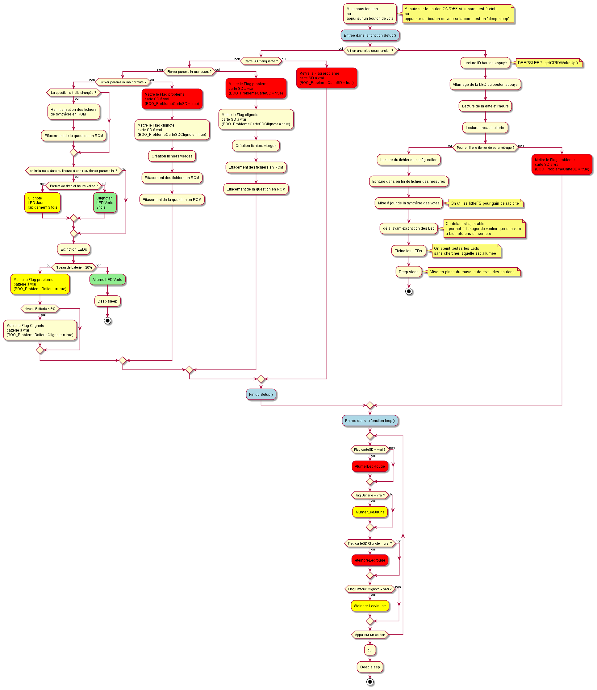

## Programme microcontrolleur ##
Dans ce répertoire, se trouve les programmes et librairies du programme du microcontroleur.

## Compilation du programme ##
Afin de pouvoir compiler le programme, il est nécessaire d'installer [l'IDE Arduino](https://www.arduino.cc/en/software) et les cartes ESP32.

### Installation des cartes ESP32 ###
Dans les préférences de l'IDE Arduino (Fichier>Préférences ou [Ctrl] + [,]), ajouter l'URL :
``` https://dl.espressif.com/dl/package_esp32_index.json``` dans les URL de cartes suplémentaires (il est possible d'avoir plusieurs jeux de cartes, il faut les séparer par des virgules), comme sur l'image ci-dessous.


Ensuite, dans le menu Tools > Boards manager Recherchez "ESP32" et installez les cartes trouvées.


Dans le menu Tools > Boards, choississez la carte **FireBeetle-ESP32**


### Installation de LittleFS pour l'ESP32 ###
LittleFS est un file system utilisé en ram disk dans l'ESP 32. Son avantage est que l'accès
est extrèmement rapide. 
[En lire plus](https://www.mischianti.org/2021/04/01/esp32-integrated-littlefs-filesystem-5/)

Il est utilisé pour stocker la synthèse des votes et la relire.

Son installation doit se faire avant la compilation du programme de la façon suivante :

* Make sure you use one of the supported versions of Arduino IDE and have ESP32 core installed.

* Download __esp32fs.zip__ zipped tool from [latest release](https://github.com/lorol/arduino-esp32fs-plugin/releases)

* In your Arduino sketchbook directory, create tools directory if it doesn't exist yet.

* Unpack the tool into "Setup->sketchbook location" /tools directory. Example: <home_dir>/Arduino/tools/ESP32FS/tool/esp32fs.jar or on OSX /Applications/Arduino.app/Contents/Java/tools/ESP32FS .

* Make sure you have mklittlefs[.exe] and mkfatfs[.exe] available at esp32 core installation folder. Look inside of \AppData\Local\Arduino15... or on zip IDE install, see "Setup->sketchbook location" hardware\espressif\esp32\tools

* For reference, see at [previous releases](https://github.com/lorol/arduino-esp32fs-plugin/releases) for copies of archived binaries in question.

* You can also use provided __package_esp32_index.template.json__ to run __get.py__ with it and download the missing binary files

* Restart Arduino IDE.

[Ressources](https://github.com/lorol/arduino-esp32fs-plugin)


### Algorithme du microcontrôleur ###

