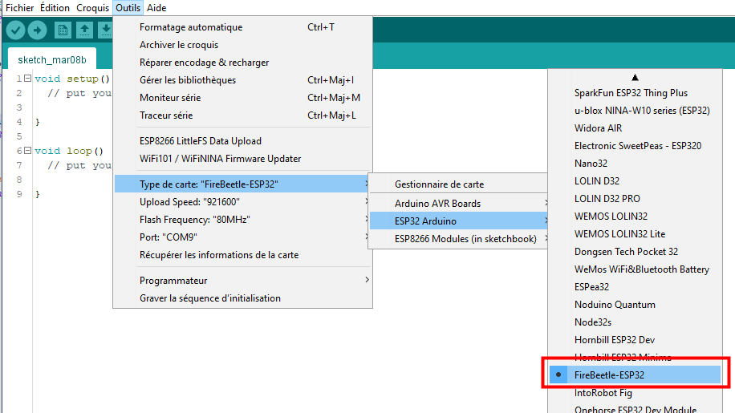

## Programme microcontrolleur ##
Dans ce répertoire, se trouve les programmes et librairies du programme du microcontroleur.

## Compilation du programme ##
Afin de pouvoir compiler le programme, il est nécessaire d'installer [l'IDE Arduino](https://www.arduino.cc/en/software) et les cartes ESP32.

### Installation des cartes ESP32 ###
Dans les préférences de l'IDE Arduino (Fichier>Préférences ou [Ctrl] + [,]), ajouter l'URL :
``` https://dl.espressif.com/dl/package_esp32_index.json``` dans les URL de cartes suplémentaires (il est possible d'avoir plusieurs jeux de cartes, il faut les séparer par des virgules), comme sur l'image ci-dessous.


Ensuite, dans le menu Tools > Boards manager Recherchez "ESP32" et installez les cartes trouvées.


Dans le menu Tools > Boards, choississez la carte **FireBeetle-ESP32**



### Installation de LittleFS ###
LittleFS est un file system utilisé en ram disk dans l'ESP 32. Son avantage est que l'accès
est extrèmement rapide. 
[En lire plus](https://www.mischianti.org/2021/04/01/esp32-integrated-littlefs-filesystem-5/)

Il est utilisé pour stocker la synthèse des votes.

Son installation doit se faire avant la compilation du programme de la façon suivante :

* Installer les librairies __LittleFS_esp32__ en passant par le gestionnaire de bibliothèques. FIXME

[Ressources](https://github.com/lorol/LITTLEFS)


### Algorithme du microcontrôleur ###

