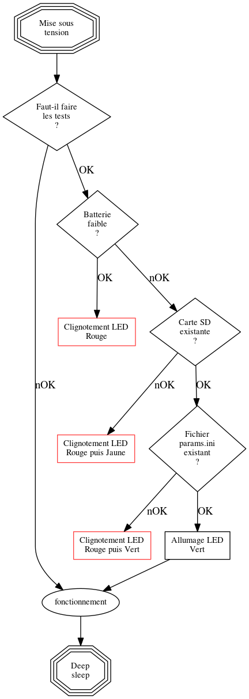

## Le projet ##
Le projet consiste à faire une borne avec 3 boutons poussoirs pouvant enregistrer les appuies sur "Oui", "Non" ou "Ne sait pas" sur une carte SD afin de recueillir des résultats pour une enquête de satisfaction.

### Conventions ###
La carte SD contient 2 fichiers :
- Fichier de paramétrage (Modifiable par le '''gestionnaire''')
- Fichier d'enregistrement des résultats (Non modifiable par le '''gestionnaire''').


### Format des fichiers ###
#### Fichier paramétrage ####
fichier : '''params.ini''' formaté comme suit :
```
[configuration]
; le siteID est votre identifiant comme il vous a été donnée par '''l'enquêteur''', ne le modifiez pas s'il ne vous le demande pas.
siteID#OpenFactory

; Cette phrase apparaitra dans le fichier résultat à votre questionnaire mais n'est pas visible sur la borne.
; Il est conseillé de définir ici une phrase courte.
question#Aimez-vous les artichauds
```


#### Fichier csv ####
Fichier '''YYYMMDD.csv''' (par exemple 20220208.csv) formaté comme suit :


Exemple d'un fichier 20220208.csv

| ID du site | Timestamp | Question | Oui | Non | Ne sait pas | Niveau Batterie
| ---------- | --------- | -------- | --- | --- | ----------- | ---------------
| OpenFactory | 08/02/2022 12:45:52 | Aimez-vous les artichauds | 1 | 0 | 0 | 90%
| OpenFactory | 08/02/2022 12:45:53 | Aimez-vous les artichauds | 1 | 0 | 0 | 90%
| OpenFactory | 08/02/2022 12:45:55 | Aimez-vous les artichauds | 0 | 0 | 1 | 90%
| OpenFactory | 08/02/2022 20:12:15 | Aimez-vous les artichauds | 0 | 1 | 0 | 50%


Exemple d'un fichier 20220209.csv

| ID du site | Timestamp | Question | Oui | Non | Ne sait pas | Niveau Batterie
| ---------- | --------- | -------- | --- | --- | ----------- | ---------------
| OpenFactory | 09/02/2022 20:12:15 | Aimez-vous les plats gratinés | 0 | 1 | 0 | 40%
| OpenFactory | 09/02/2022 20:12:15 | Aimez-vous les plats gratinés | 1 | 0 | 0 | 40%
| OpenFactory | 09/02/2022 20:12:15 | Aimez-vous les plats gratinés | 1 | 0 | 0 | 30%


## Programmes ##
### Clignotement des LEDs ###
Il y a 3 LEDs sur la borne, chacune au-dessus d'un bouton afin d'indiquer que le vote d'un '''utilisateur''' a bien été pris en compte. Il est également possible d'afficher des alarmes en fonction du clignotement des LEDs.


| Leds clignotante (une à la fois) | Signification
|----------------------------------|---------------
| Vert | tout est OK
| Rouge | Batterie faible
| Rouge, Jaune | Pas de carte SD
| Rouge, Vert | Fichier paramétrage non valide.
| Rouge, Vert, Jaune | Erreur inconnue.


### Algorithme du microcontrôleur ###



fonctionnement :
* si bouton appuyé.
  * Wake up.
  * Allumage de la LED du bouton
  * Lecture "Time + Date" via RTC
  * Lecture niveau batterie (conversion en %)
  * Lecture fichier params.ini pour récupérer la question + siteID
  * Ouverture fichier csv : YYYYMMDD.csv en append (écriture à la fin)
  * Formatage et écriture la ligne dans le fichier CSV
  * Pause "anti-rebond".
* Eteind les LEDs (On éteint toutes les Leds, sans chercher laquelle est allumée).


Pour la partie '''Faut-il faire les tests''' voir les possibilités techniques :

# Voir s'il est possible de savoir qu'on vient de mettre sous tension le microcontrôleur (et non pas qu'on sort d'un Deep sleep). {{fixme}}
Oui, la fonction esp_sleep_get_wakeup_cause() permet de savoir pourquoi l'ESP à rebooté : 
* ESP_SLEEP_WAKEUP_EXT0 : réveil de deep sleep à partir d'un  signal extérieur (RTC IO)
* ESP_SLEEP_WAKEUP_EXT1 : réveil de deep sleep à partir d'un parmi plusieurs signaux extérieurs (RTC IO) (Utilisé par la borne)
* ESP_SLEEP_WAKEUP_TIMER : réveil par le timer interne (au bout d'un certain temps
* ESP_SLEEP_WAKEUP_TOUCHPAD : réveil par une touche tactile
* ESP_SLEEP_WAKEUP_ULP : réveil par un programme de l'ULP
* Si aucune des autres : reboot du à une coupure d'alimentation
